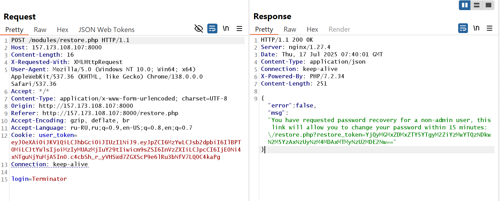
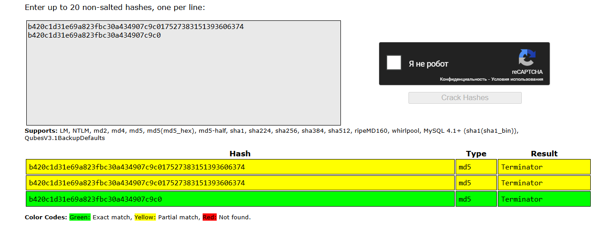
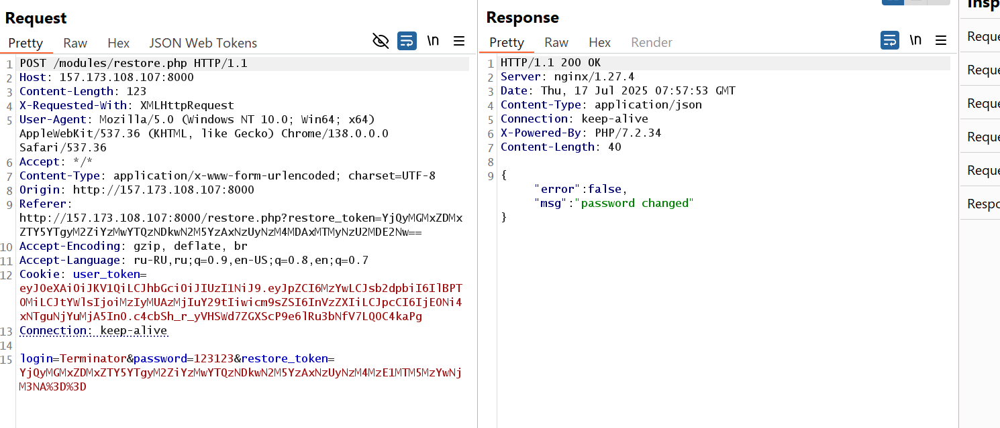

Inside login page there is a button to restore lost password that goes under **/modules/restore.php**.  
![restore_page}(../images/restore_page.jpg)  
After submiting login to restore password, it redirects back to home page but, in http histore of Burp suite we can see that it made POST request with login=USER
  

In response we get JSON with link to reset password.  
>/restore.php?restore_token=YjQyMGMxZDMxZTY5YTgyM2ZiYzMwYTQzNDkwN2M5YzAxNzUyNzM4MzE1MTM5MzYwNjM3NA==

Given token is encoded in base64 which gives.  
> b420c1d31e69a823fbc30a434907c9c017527383151393606374

Which is actually md5 hash where b420c1d31e69a823fbc30a434907c9c0 is md5 and rest is timestamp with some data.
  

Having the correct token we can change the password by sending another **POST** request to **restore.php**. 
  

However, its not that easy to change admin password, when we send a request with the admin login to change password, we are not getting direct link, instead its response with  
> {"error":false,"msg":"link created"}

**PoC**
